# Stock-Analysis

## Overview of Project
The purpose of this project is to analyze a group of green energy stocks, all in an effort to advise a family who wants to invest in green energy. To accomplish this, I've used an excel file containing specific green energy stock data, and excel's Visual Basic for Applications (VBA) computer programming language. In this project, I've used VBA macros that can trigger pop-ups and inputs, read and change cell values, and format cells; used for loops and conditionals to direct logic flow; and used nested for loops. Also, once I had completed the original script, I refactored the script to improve the execution time.

### Refactored Script
For reference, the refactored script I used is as follows. Comments are added to indicate the output/intended results of each specific code sequence.

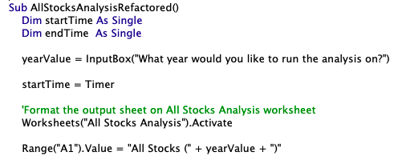
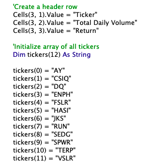
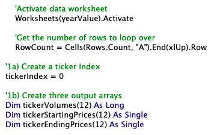
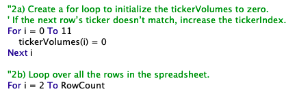
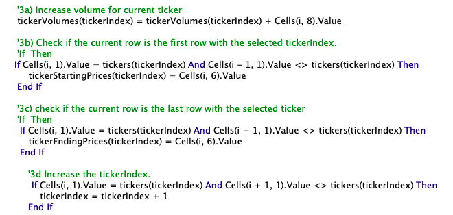
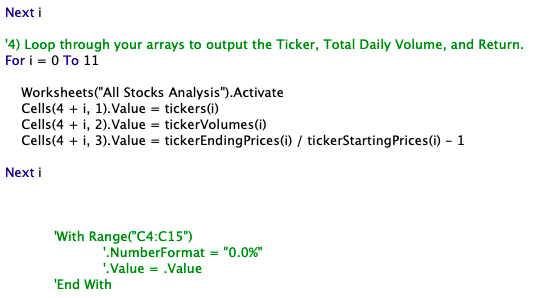
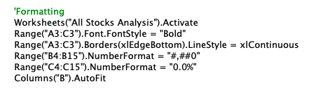
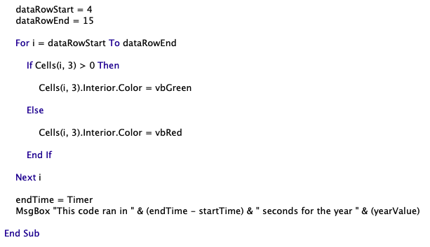

### Reslts
Below you can see the stock performances for 2017 and 2018. Overall, green stocks in 2017 outperformed those same stocks in 2018. The only two stocks which had positive performances in 2017 and 2018 were ENPH and RUN. Both of these stocks experienced higher trade volumes in 2018, compared to 2017.

### Stock Performances 2017
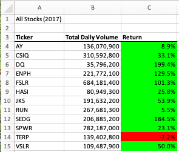

### Stock Performances 2018
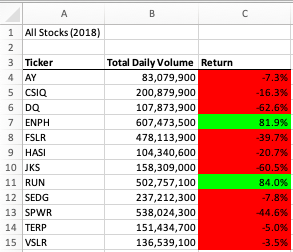

### Execution Times
Below are screen shots of pop ups showing the execution times - for each year - of the original scripts versus the refactored scripts. As you can see, the refactored script had significantly lower execution times, compared to the original script.

### 2017 Original Script Execution Time

### 2017 Refactored Script Execution Time

### 2018 Original Script Execution Time
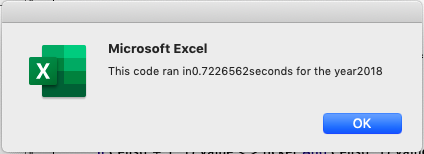

### 2018 Refactored Script Execution Time

### Summary

In a summary statement, address the following questions.

What are the advantages or disadvantages of refactoring code?
How do these pros and cons apply to refactoring the original VBA script?

There is a detailed statement on the advantages and disadvantages of refactoring code in general.
There is a detailed statement on the advantages and disadvantages of the original and refactored VBA script.
